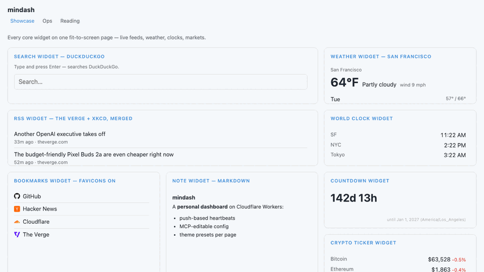
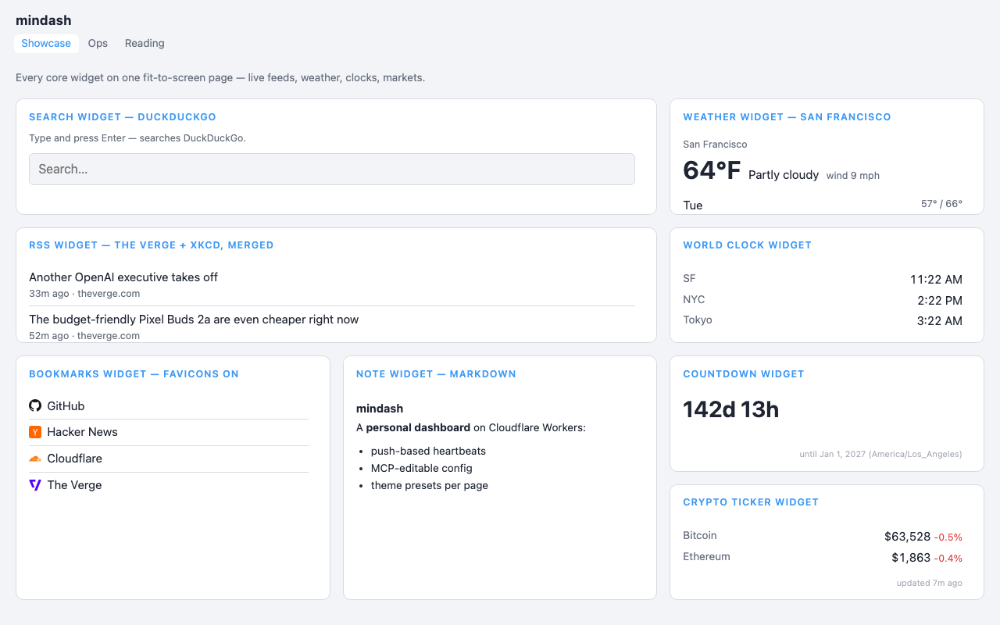
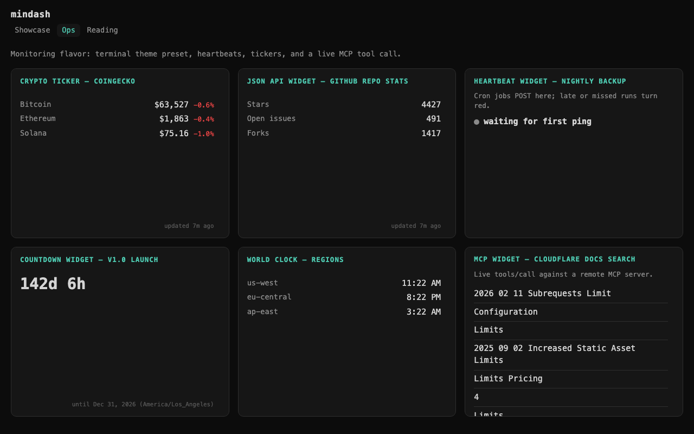
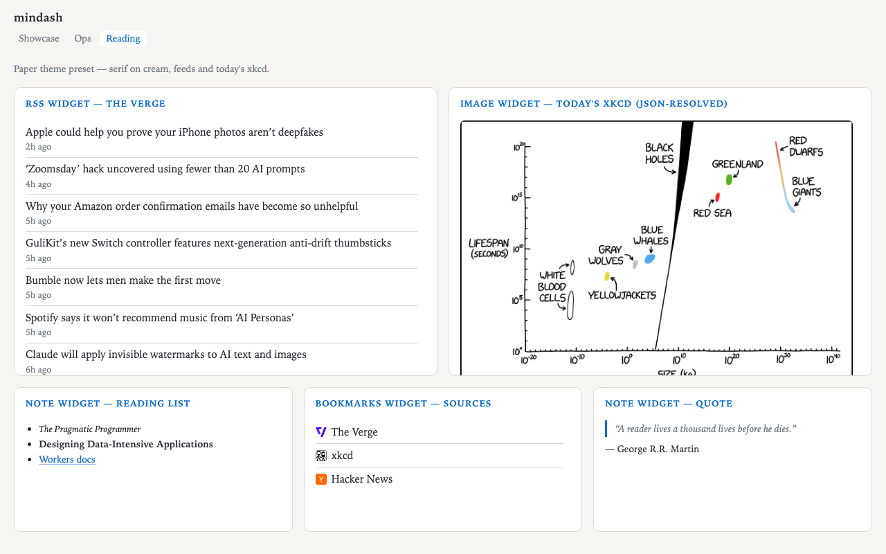
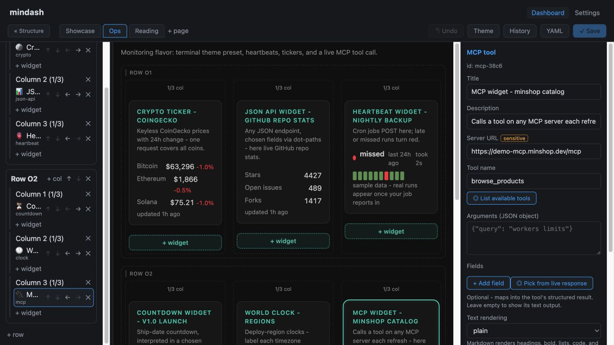

# mindash

mindash is a self-hosted dashboard you can edit visually — or hand to an
AI agent. It pulls from feeds, APIs, web pages, and MCP tools; accepts live
updates from jobs and automations; and keeps the last good data visible
when an upstream fails.

It has the compact, glanceable feel of a personal homepage, but it is also
useful as a lightweight operations board. The app runs as one Cloudflare
Worker with server-rendered dashboard pages, passkey ownership, encrypted
credentials, and versioned runtime config.

[](https://deploy.workers.cloudflare.com/?url=https://github.com/ddyy/mindash)
[](https://github.com/ddyy/mindash/actions/workflows/ci.yml)

**[Live demo →](https://demo.mindash.dev/)** — explore Home, Ops, Misc,
and an Everything page containing all twenty widget types.



## What makes mindash different

- **Edit it three ways** — use the visual editor, edit the YAML document,
  or connect an agent through MCP. The MCP server supports Claude.ai
  remote connectors through OAuth 2.1 as well as static tokens for
  header-capable clients.
- **Pull and push data** — read RSS, APIs, JavaScript-rendered web pages,
  and remote MCP tools; monitor sites; or push heartbeats and log lines
  directly from cron jobs, CI, and automations.
- **Fail gracefully** — scheduled refreshes happen away from page views.
  A failed upstream leaves the last successful payload on screen and
  marks it stale instead of turning the card into an error message.
- **Own the whole thing** — passkeys, encrypted origin-bound credentials,
  public and private pages, scoped agent access, compare-and-set updates,
  and 30-version history with restore.
- **Use it every day** — responsive themes, kiosk mode, a new-tab
  extension, and one-click deployment to your own Cloudflare account.

| Home — default theme | Operations — `terminal` preset | Personal — `paper` preset |
| --- | --- | --- |
|  |  |  |

Three pages, three built-in themes. All of it was created, themed, and
populated through the MCP API — no editor clicks involved — and remains
fully editable in the visual editor.

## Install

Three ways in, easiest first:

**1. One click** - the Deploy to Cloudflare button above. It copies this
repo into your GitHub account, provisions the KV/D1/R2 resources on your
Cloudflare account, and deploys. The Worker bootstraps its own database
schema on the first visit - nothing to run.

**2. npm create** - the standard Workers scaffolder accepts this repo as
a template:

```bash
npm create cloudflare@latest my-dashboard -- --template=ddyy/mindash
```

**3. Clone it**:

```bash
git clone https://github.com/ddyy/mindash && cd mindash
npm install
npm run dev
```

### First run

A fresh instance has no owner and no dashboard yet, so it shows one
screen: **create the first passkey** to claim it (no token needed - that
window closes the moment a passkey exists; every later enrollment needs a
one-time token). Signing in then lands on setup, which asks two things:

- **Timezone** - pre-filled from your browser. Clocks, countdowns, and
  calendars inherit it, so events land at the right hour instead of UTC.
  Any widget can still override it, and `timezone:` at the top of the
  config document is the same setting.
- **Example widgets or an empty page** - the examples are a working
  dashboard to edit (news, weather, clocks, an MCP call); empty is one
  blank page and the gallery.

Setup only ever writes over an untouched instance - once a dashboard has
content, it refuses and points at the editor.

Local dev needs no resource setup (state is name-keyed on disk). To
deploy a cloned copy, create the four resources and paste their ids
into `wrangler.jsonc` where marked:

```bash
npx wrangler kv namespace create CACHE
npx wrangler kv namespace create OAUTH_KV
npx wrangler d1 create mindash
npx wrangler r2 bucket create mindash-assets
npx wrangler deploy
```

However you install: open the instance and it offers a **one-time
claim** - create the first passkey and you own it. Then hit **Edit** and
build your dashboard (or point an agent at `/mcp`).

### Use it as your browser home

- **Homepage / startup page** (no extension needed): set your instance
  URL as the browser homepage and startup page - Chrome: Settings > On
  startup; Firefox: Settings > Home.
- **New tab page**: browsers need an extension for that - this repo
  ships one in [`extension/`](extension/).
  [Download the packaged extension](https://github.com/ddyy/mindash/releases/latest/download/mindash-extension-1.0.0.zip)
  (or use the folder from a clone), unzip it, then load it unpacked from
  `chrome://extensions` (Developer mode → Load unpacked) and pick the
  extracted `extension` folder. Enter your instance URL once and every
  new tab is your dashboard. `storage` is its only permission and your
  URL is the only thing it stores. The search and bookmarks widgets are
  built for exactly this.

## Widgets

Twenty types, each a self-describing def in `src/widgets/` (validation,
editor form, fetch, render, CSS in one file):

- **Feeds** — RSS/Atom (multiple feeds merged newest-first, entity
  decoding), YouTube channels/playlists (keyless via YouTube's RSS,
  thumbnails, @handle search), Hacker News
- **Personal** — weather (geocoded search, C/F), calendar (iCal with
  simple recurrence + EXDATE), bookmarks (optional favicons via one fixed
  icon origin), search box (DuckDuckGo, Google, Bing, Brave, Startpage,
  Ecosia, Kagi, Wikipedia, and YouTube presets — each setting the engine's
  own query parameter — or a custom engine), notes (safe markdown subset),
  world clock, countdown (timezone-aware, DST-correct)
- **Markets** — crypto (CoinGecko, searchable coin picker) and stocks
  (Yahoo, symbol search) with colored day deltas
- **Display** — JSON API (dot-path field mapping with a live field
  picker), web scrape (Browser Rendering loads the page in headless
  Chromium; CSS selectors map elements to a list - works on JS-only
  pages and sites that block plain server fetches), image (direct URL
  with webcam cache-busting, R2 upload, or JSON-resolved like xkcd/APOD
  with a pinned image origin), sandboxed iframe embeds
- **Monitoring** — site monitor (HEAD checks with latency, per-site
  up/down history bars; a failing site is a red row, never a broken card)
- **Integration** — MCP widget (call a tool on any Streamable-HTTP MCP
  server — unauthenticated, static bearer, or OAuth via a one-time
  Settings sign-in; fields, markdown, or link-list rendering), push
  heartbeats (cron jobs report in; late/missed turn red), push log
  (lines POSTed in - cron output, CI results, agent updates)

Pull widgets are prefetched by a cron sweep behind fenced D1 leases and
cached in D1 rows; a page view never fetches an upstream. A failed fetch
leaves the last good data in place, so the card keeps working and its
stamp says whose timestamp it is - `showing data from 3h ago` under the
failure, or `updated 3h ago · overdue` when data ages far past its
interval with nothing logged as failing. Healthy cards stay unmarked.

### Recipes

The JSON API widget's list mapping covers many "dedicated" widgets with
plain config. GitHub releases:

```yaml
- type: json-api
  title: workers-sdk releases
  url: https://api.github.com/repos/cloudflare/workers-sdk/releases?per_page=8
  refresh_interval: 2h
  items: "."
  item_title: tag_name
  item_url: html_url
  item_meta: published_at
```

`items: "."` maps the response root (the releases array); each row links
its `tag_name` to the release page. Swap `/releases` for `/tags` or
`/issues` and rebind the paths for other GitHub lists. Unauthenticated
GitHub API calls are rate-limited per source IP, which Workers share -
if a card flakes, save a GitHub token under Settings - API credentials
and select it in the widget's Credential field.

Reddit blocks plain server fetches from datacenter IPs (its `.json`
and `.rss` endpoints 403 from Cloudflare), but a full browser passes -
so a subreddit is just a scrape recipe:

```yaml
- type: scrape
  title: r/selfhosted
  url: https://www.reddit.com/r/selfhosted/
  item_selector: a[slot="full-post-link"]
  refresh_interval: 30m
```

(Use www.reddit.com, not old.reddit.com - the old UI now bounces
logged-out visitors to a login wall from many IPs.)

## Editor

`/settings/editor` — outline · live preview · inspector, with YAML as an
escape hatch. Drag-and-drop plus keyboard/button equivalents everywhere,
draggable column widths snapping to named fractions, live draft probes
(new widgets show real data before saving), semantic save summaries,
version history with restore, undo, and a Theme panel.



## Theming

Global theme + named presets, selectable **per page** (built-in palettes:
nord, solarized-dark, gruvbox, catppuccin, paper, terminal — or copy one
and customize). Colors (hex, native pickers), fonts, font/title sizes,
corner radius, card opacity, background image and logo (uploaded to R2 or
external URL), dashboard title. Per page: fit-to-screen layouts (rows
take height fractions), public sharing (no session, noindex, share link),
descriptions, and kiosk/fullscreen viewing (`?kiosk=1` or the ⛶ button;
page switching stays in fullscreen).

## Security model

- **Rendering**: escaping by construction (`html` tagged template); CSP
  `default-src 'none'` with exact per-feature allowlists (`frame-src`
  from iframe widgets, `form-action` from search engines, `img-src` from
  theme/image/favicon origins). Pages ship only first-party scripts
  (`script-src 'self'; connect-src 'self'`): the clock/countdown ticker
  and `ui.js` (background refresh, fullscreen page switching) — no
  third-party script can ever load, on public or private pages.
- **Outbound fetches**: https/public-only with bounded bodies, deadlines,
  and manual redirects; credentialed requests never follow redirects.
- **Credentials**: never in config. API/MCP bearer credentials live in an
  encrypted D1 vault (AES-GCM; master key auto-generated into KV, or a
  `MASTER_KEY` Worker secret if you prefer) - added once in Settings,
  referenced by name from config. Each credential is pinned to its widget
  types and exact destination origin, and the pin is the AEAD associated
  data: retargeting a credential breaks decryption instead of leaking it.
  Credential-less MCP widgets may call any public https server - a call
  that carries no credential carries no authority worth allowlisting.
  Heartbeat push tokens are per-widget D1 rows (hash only, created in
  Settings, shown once); `PUSH_TOKEN_*` Worker secrets still work as a
  legacy fallback.
- **Auth**: passkeys only (single-use enroll/recover tokens, owner epoch
  revocation). Config writes are compare-and-set with semantic diff
  classification: layout-scope vs sources-scope (source URLs, schedules,
  making a page public, external theme images).

## MCP

mindash speaks MCP in both directions. As a **client**, the MCP widget
calls a tool on any public Streamable-HTTP server each refresh —
unauthenticated, with a vault credential, or through an OAuth connection
(Settings → MCP connections runs the full discovery → registration →
PKCE flow in one click and auto-refreshes tokens).

As a **server**: a stateless Streamable-HTTP endpoint at `POST /mcp`.
Two auth lanes:

- **OAuth 2.1** (claude.ai remote connectors): the Worker is its own
  authorization server — discovery, DCR (rate-limited, https/loopback
  redirects only), PKCE S256, consent with passkey step-up for
  `config:sources`, revocable grants in `/settings`.
- **Static bearer tokens** for header-capable clients:

```bash
./scripts/seed-mcp-token.sh layout my-agent    # ordering/titles/theme
./scripts/seed-mcp-token.sh sources my-agent   # + sources/create/remove/public
```

```bash
claude mcp add --transport http mindash http://localhost:8787/mcp \
  --header "Authorization: Bearer <token>"
```

Tools: `list_config`, `update_config` (full document — pages, themes,
layout), `add_widget`, `update_widget`, `remove_widget`,
`refresh_widget`, `rollback_config`, `snapshot_config`. Mutations take
`base_version` and return a structured conflict when stale.

## Push widgets

Create a heartbeat or log widget, then mint its bearer token under
**Settings → Push tokens** (shown once, stored hashed). Then:

```bash
# one-shot ping (claims its scheduled occurrence when in window)
curl -fsS -X POST -H "Authorization: Bearer $TOKEN" \
  -H "content-type: application/json" -d '{"bytes": 12345}' \
  http://localhost:8787/push/backup-demo

# explicit failure
curl -fsS -X POST -H "Authorization: Bearer $TOKEN" \
  "http://localhost:8787/push/backup-demo?status=fail"

# timed run: /start returns a run_id, completion targets it
RID=$(curl -fsS -X POST -H "Authorization: Bearer $TOKEN" \
  http://localhost:8787/push/backup-demo/start | jq -r .run_id)
curl -fsS -X POST -H "Authorization: Bearer $TOKEN" \
  "http://localhost:8787/push/backup-demo?rid=$RID"
```

The cron sweep materializes timeout rows for missed occurrences (bounded
catch-up) and times out started runs past their deadline.

Log widgets take lines instead of pings - plain text or JSON, newest 100
kept:

```bash
curl -fsS -X POST -H "Authorization: Bearer $TOKEN" \
  -d 'backup finished: 12.4GB in 3m' \
  "http://localhost:8787/push/deploy-log"

curl -fsS -X POST -H "Authorization: Bearer $TOKEN" \
  -H "content-type: application/json" \
  -d '{"text": "disk 91% full", "level": "warn"}' \
  http://localhost:8787/push/deploy-log
```

## Auth setup

A **fresh instance has a claim window**: until the first passkey exists,
`/login` offers a tokenless "create the first passkey" flow — whoever
enrolls first owns the instance. Deploy and claim in the same sitting.

If you want a **custom domain, attach it before claiming**: a passkey is
bound to the domain that created it, so one made on `*.workers.dev` will
not sign you in on your own domain. The login page says so while the
choice is still free. Claiming first is recoverable, not fatal — enroll
again on the new domain with a one-time token.

Every enrollment after the first requires a one-time token:

```bash
./scripts/seed-token.sh enroll     # one-time token; enroll a passkey at /login
./scripts/seed-token.sh recover    # account-reset ceremony token
```

## Runtime config

Config is a versioned document in D1 (compare-and-set, copy-forward
rollback, 30-version history). Edit it in the editor, over MCP, or as
YAML. `config.yaml` is only the first-boot seed. Widget `id`s are
server-assigned — never write them by hand.

## Dev

```bash
npm install
npm run migrate:local
npm run dev            # wrangler dev --test-scheduled on :8787
npm test               # node:test suite (esbuild-bundled, no framework)
npm run check          # tsc
curl "http://localhost:8787/cdn-cgi/handler/scheduled"   # trigger a sweep
```

Client scripts (`*.client.js`) are real JavaScript files imported as text
via the wrangler Text rule — no template-literal escaping layer. Push
tokens are created in Settings (`.dev.vars` only matters for the legacy
`PUSH_TOKEN_*` lane).

## Deploy

Resource creation and the first deploy are the clone instructions above
(one authoritative sequence — the Worker migrates its own schema on
first request, so no separate migration step). After the first deploy:

```bash
npx wrangler deploy                            # subsequent deploys
./scripts/seed-token.sh enroll --remote        # extra passkeys after the first claim
```

Create the KV namespaces and D1 database on first deploy (ids in
`wrangler.jsonc`). Nothing else to edit: the checked-in config is the
production posture, including the `global_fetch_strictly_public`
compatibility flag and the CIMD authentication lane. That flag breaks
outbound fetch in local workerd, so `npm run dev` and the integration
suites drop it on the command line - local development needs no config
changes either.
